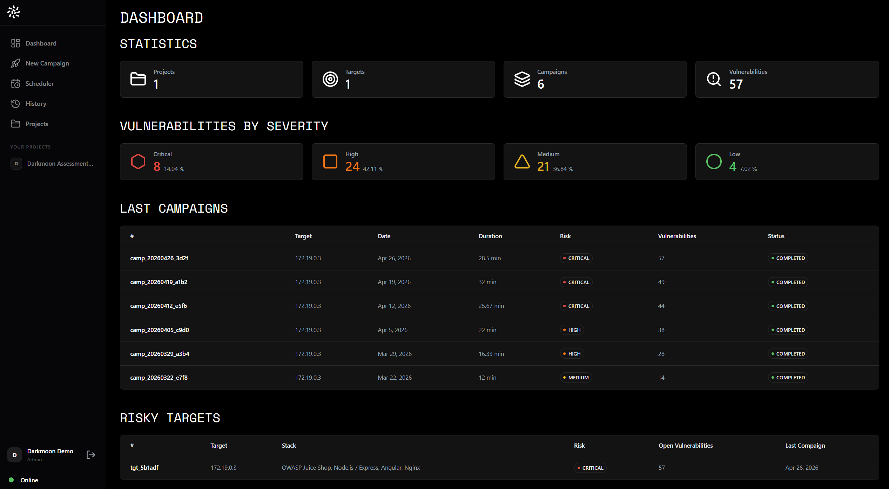

<div align="center">

<a href="https://github.com/ASCIT31/Dark-Moon"></a>

# n8n-nodes-darkmoon

### Part of [Darkmoon, the open source autonomous AI penetration testing platform](https://github.com/ASCIT31/Dark-Moon)

[](https://github.com/ASCIT31/Dark-Moon)

[](https://docs.n8n.io/integrations/community-nodes/installation/) [](LICENSE) [](https://dark-moon.org) [](https://dark-moon.org)

</div>

If Darkmoon is useful, a star on the [main repo](https://github.com/ASCIT31/Dark-Moon) helps others find it.

An [n8n](https://n8n.io) community node for [Darkmoon](https://github.com/ASCIT31/Dark-Moon), the local, privacy-first autonomous AI penetration testing engine.

<div align="center">



<sub>The Darkmoon dashboard, campaigns, severity breakdown and the findings an n8n workflow pulls back.</sub>

</div>

It lets an n8n workflow **trigger a Darkmoon pentest against a target you are authorised to assess, pull back the findings, and review the fix pull requests the Darkmoon Pro remediation tier prepares**, so security testing and remediation review can be wired into CI/CD, ticketing, chat and reporting automations like any other step.

> Darkmoon **runs and validates** security tests. It does not, and this node does not, guarantee that a system is secure. Findings can include false positives and must be reviewed by a qualified human. Only run assessments against systems you own or have explicit written authorisation to test. **This node never merges a pull request** — every fix is left for a person to review and merge.

[Installation](#installation) · [Credentials](#credentials) · [Operations](#operations) · [Remediation](#remediation) · [How it works](#how-it-works) · [Example workflow](#example-workflow) · [Security notes](#security-notes) · [Limitations](#limitations) · [Development & tests](#development--tests) · [Submission plan](#submission-plan)

## Installation

Follow the [n8n community nodes installation guide](https://docs.n8n.io/integrations/community-nodes/installation/). In a self-hosted n8n:

**Settings → Community Nodes → Install**, then enter `n8n-nodes-darkmoon`.

## Credentials

This node talks to the **Darkmoon Dashboard API** (the FastAPI service shipped with Darkmoon, typically on port `8000`). Darkmoon issues a short-lived JWT from `POST /api/v1/auth/login`, so the node logs in at run time using stored credentials.

Create a **Darkmoon API** credential with:

| Field      | Example                       | Notes                                   |
| ---------- | ----------------------------- | --------------------------------------- |
| Base URL   | `http://darkmoon.internal:8000` | Base URL of the Darkmoon Dashboard API |
| Username   | `admin`                       | Dashboard user                          |
| Password   | `••••••••`                    | Dashboard password                      |

Use the credential's **Test** button to verify — it calls the real login endpoint.

## Operations

### Run Pentest
Starts a pentest against **Target** (URL or host). With **Wait for Completion** on (default), the node polls the run to completion and returns the resolved campaign plus its findings and severity stats. With it off, it returns the `run_id` immediately for a later **Get Findings** call.

Options: additional targets, out-of-scope, exclude, focus areas, minimum severity, safe-harbor reference, poll interval and timeout. See [Remediation](#remediation) for **Enable Remediation**.

### Get Findings
Returns the vulnerabilities for a **Campaign ID**, with aggregated stats (`by_severity`, `by_category`, `by_status`).

### Get Report
Returns the markdown report for a **Campaign ID**.

### List Campaigns
Lists past and running campaigns.

### List Pull Requests
Lists the fix pull requests Darkmoon prepared. Optionally restrict to one **Campaign ID** (the only filter the API applies server-side). Additional **Filters** (state, provider, repository) are applied **client-side** to the returned records. States are the real Darkmoon values: `proposed`, `draft`, `open`, `merged`, `closed`, `error`.

### Get Pull Request
Returns one pull-request record by **Pull Request ID** (diff summary, validation, linked findings).

### Get Pull Requests by Finding
Returns the pull requests that address a specific **Finding ID**.

## Remediation

Darkmoon can, after confirming an issue, generate a fix and open a **pull request** for a human to review. This is a Pro capability that runs **during** the pentest — it is not a separate API call. In the node it is turned on with **Enable Remediation** on the *Run Pentest* operation (default **off** — with it off, behaviour is unchanged and only findings are returned).

When **Enable Remediation** is on, provide under *Remediation Settings*:

| Setting | Maps to | Notes |
| --- | --- | --- |
| **Credential Reference** (required) | `credential_id` → `CREDENTIAL_REF` | **Opaque id** of an SCM credential stored in Darkmoon's vault. **Not a token.** |
| Repository URL | `git_repo` → `REPO` | Repo where the fix PR is opened |
| Allow Darkmoon to Create the Repository | `create_repo` → `CREATE_REPO` | |
| Wait for Pull Requests | (client) | Poll after the run until a PR appears |
| Pull Request Wait Timeout (Minutes) | (client) | Bounded wait; never loops forever |

The pull requests appear on the *Run Pentest* output (`pull_requests`, `total_pull_requests`) and can also be read later with the pull-request operations above.

**Pull requests are read-only through the API and this node**: PR records are created by Darkmoon's remediation agent during the run. There is no endpoint to open, update or merge a PR, and this node deliberately provides none. Merging is always a manual human step in your SCM.

### Remediation lifecycle

```
confirmed finding → generate fix → validate in sandbox → retest → open pull request → human review → manual merge
```

Darkmoon only remediates issues it has confirmed and can reproduce; the fix is validated and the target retested before a PR is opened. The PR then waits for a person. Nothing in this pipeline merges automatically.

## How it works

The node maps to the Darkmoon Dashboard REST API (read from `Dark-Moon-Front-API`, branch `dev`):

| Step                    | Endpoint                                            |
| ----------------------- | --------------------------------------------------- |
| Authenticate            | `POST /api/v1/auth/login`                            |
| Start a run             | `POST /api/v1/run/campaign`                          |
| Follow run state        | `GET /api/v1/run/logs/{run_id}` (JSONL, terminal event = done) |
| Resolve the campaign    | `GET /api/v1/campaigns` (diff before/after the run)  |
| Fetch findings          | `GET /api/v1/vulnerabilities?campaign_id=…`          |
| Fetch report            | `GET /api/v1/campaigns/{id}/report`                  |
| List pull requests      | `GET /api/v1/pull-requests?campaign_id=…`            |
| One pull request        | `GET /api/v1/pull-requests/{pr_id}`                  |
| Pull requests by finding| `GET /api/v1/pull-requests/finding/{vuln_id}`        |

The trigger endpoint returns a `run_id`; the pentest agent creates the campaign itself. The node therefore correlates a run to its campaign by snapshotting the campaign set before the run and picking the one that appears afterwards. See [`docs/API.md`](docs/API.md) for the exact contract and a proposed first-class `run_id → campaign_id` link.

## Example workflow

Import [`examples/darkmoon-pentest-and-remediation-review.json`](examples/darkmoon-pentest-and-remediation-review.json) — **"Darkmoon Pentest and Remediation Review"**. It triggers a pentest on an authorised demo lab target, enables remediation with a credential reference, waits for completion, lists the reviewable pull requests (`proposed`/`draft`/`open`), and summarises everything into a message ready for a Slack / Microsoft Teams / Jira / Linear / GitHub / email node. It **merges nothing**. Replace the target, the Darkmoon credential, and the opaque credential reference before running.

## Security notes

- **No SCM tokens in workflow parameters.** Remediation takes an **opaque credential reference** (a Darkmoon vault id), never a raw token or key. The actual SCM secret stays in Darkmoon's encrypted vault; the Darkmoon dashboard password stays in the n8n credential store.
- **No secrets in logs.** The node never logs requests or credentials, and its errors surface only the API's own `detail` message — the JWT, password and credential value are never included (covered by a dedicated test).
- **No automatic merges.** The Darkmoon API exposes pull requests read-only; this node has no write/merge operation. Merging is always a manual human decision in your SCM.
- **Authorised targets only.** Run assessments only against systems you own or are explicitly authorised to test.

## Limitations

- The node **does not merge, edit or close** pull requests — PR records are produced by Darkmoon's remediation process and are read-only here.
- **Enable Remediation must be on at launch** — remediation runs during the pentest, so it cannot be started after the fact for a finished run.
- Remediation typically **requires a valid SCM credential reference** and a repository, and only acts on **confirmed, reproducible** findings — so a run can complete with findings but no pull requests.
- The API's only server-side PR filter is `campaign_id`; state / provider / repository filters in *List Pull Requests* are applied **client-side**.
- Run→campaign correlation is best-effort (snapshot diff) until the API exposes a first-class `run_id → campaign_id` link (see [`docs/API.md`](docs/API.md)).

## Development & tests

```bash
npm install
npm run build         # tsc + copy icons into dist/
npm run lint          # eslint-plugin-n8n-nodes-base (the verification ruleset)
npm run test:unit     # mock-transport unit tests (no server needed)
npm run test:e2e:local # real local API + stub engine, full happy path
```

### Unit tests

`test/unit.mjs` drives the compiled `DarkmoonClient` with a mock transport and covers remediation validation, HTTP error mapping (401/403/404/500), empty and malformed responses, bounded wait/poll timeouts, and that **no secret ever leaks into an error message**.

### End-to-end test

`test/run_local_api.sh` starts the **real** Darkmoon Dashboard API locally (no Docker required — it is a FastAPI-over-JSON service) against an isolated copy of its data store, with the `opencode` pentest engine replaced by `test/stub_opencode`. The stub drives the **real** dashboard write-path (`init_live_campaign` / `push_finding` / `finalize_campaign` / `pr_store.link_pr`), so the full trigger → wait → resolve-campaign → findings → report → **remediation → pull requests** flow is exercised against real API code:

```bash
FRONT_API=/path/to/Dark-Moon-Front-API bash test/run_local_api.sh
```

The engine's LLM-driven discovery (sealed container + license) is not part of this test; the finding and pull request it produces are labelled lab fixtures, not LLM results.

## Submission plan

This package targets the n8n community-nodes registry (npm) and the **verified community nodes** programme. It already meets the structural rules: `n8n-nodes-` name, `n8n-community-node-package` keyword, `n8n` object with `n8nNodesApiVersion`, no runtime dependencies, MIT licence, English UI/docs, no filesystem/env access in node code, and it passes the linter. Publishing is wired to GitHub Actions with npm **provenance** (`.github/workflows/publish.yml`), as required for verification from 2026-05-01.

Steps to publish:
1. Push this package to `github.com/ASCIT31/n8n-nodes-darkmoon`.
2. `npx @n8n/scan-community-package n8n-nodes-darkmoon` and fix anything it flags.
3. Create a GitHub release → the workflow publishes to npm with provenance.
4. Submit for verification via the n8n creator portal / [submit community nodes](https://docs.n8n.io/integrations/creating-nodes/deploy/submit-community-nodes/) process.

## License

[MIT](LICENSE)
